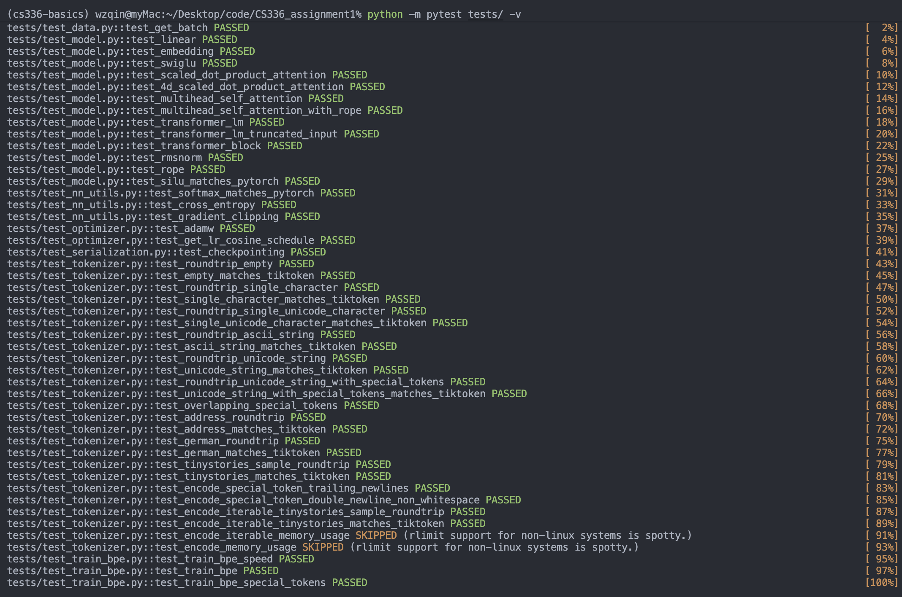

# CS336 任务一：从零构建 Transformer 语言模型



## 项目简介

本仓库是我对斯坦福大学 CS336 课程任务一 "Building a Transformer LM" 的个人实现。该任务旨在从零开始，手动实现并训练一个完整的 Transformer 语言模型。

本项目目前主要包含 **Tokenization (分词)** 和 **简单语言模型 (simple LM)** 以及**训练组件**大部分的实现代码，希望能为对 Transformer 底层原理感兴趣的同学提供一些参考。

## 已实现功能

本项目严格遵循 CS336 任务要求，从零开始实现了训练一个 Transformer 语言模型所需的各个关键部分，覆盖了从数据处理到模型训练的全流程。

### 1. BPE 分词器 (Tokenizer)

-   **BPE 算法实现**: 在 `train_bpe.py` 中实现了完整的 BPE 算法训练逻辑，能够从原始文本语料中学习词汇表 (vocabulary) 和合并规则 (merges)。
-   **分词器封装**: `Tokenization.py` 文件中封装了分词器主类，加载训练好的词汇表和规则后，可执行高效的文本编码 (`encode`) 和解码 (`decode`)。

### 2. Transformer 核心架构

-   **Decoder-Only 模型**: 在 `model.py` 中搭建了完整的、目前主流的仅解码器 (Decoder-Only) 语言模型，通过堆叠 Transformer Block 构建。
-   **Transformer Block**: `transformer.py` 中实现了 Transformer 的核心单元，它内部整合了以下自研组件：
    -   **因果多头自注意力 (`causal_multi_heads_selfattention.py`)**: 实现了支持掩码 (Causal Mask) 的多头自注意力机制，确保模型在训练和生成时无法看到未来的信息。
    -   **前馈神经网络 (`feedforward.py`)**: 实现了 Position-wise 前馈网络层 (FFN)。
    -   **旋转位置编码 (RoPE) (`rope.py`)**: 实现了 Rotary Position Embeddings，一种性能优越且广泛应用的相对位置编码方案。
    -   **RMSNorm 层归一化 (`RMSNorm.py`)**: 实现了 Root Mean Square Layer Normalization，一种比传统 LayerNorm 更高效的归一化方法。
-   **基础网络层**: 从零实现了构成 Transformer 的基础模块，包括 `embedding_layer.py` (词嵌入层) 和 `linear_layer.py` (线性层)。

### 3. 训练组件

-   **AdamW 优化器**: 在 `AdamW.py` 中完整实现了 AdamW 优化器，包括一阶和二阶动量估计、偏差纠正以及解耦的权重衰减 (weight decay) 逻辑。
-   **utils**: 在 `utils.py`中实现了loss function, checkpoint, load_data, softmax, grad_clip, cosine_anneal_lr_schedule 等功能


## 项目结构

```
cs336_basics/
│
├── __init__.py                         # 包初始化文件
├── Tokenization.py                     # BPE 分词器主类
├── train_bpe.py                        # BPE 分词器训练脚本
├── embedding_layer.py                  # 词嵌入层
├── linear_layer.py                     # 线性层
├── RMSNorm.py                          # RMSNorm 层归一化
├── rope.py                             # RoPE 旋转位置编码
├── feedforward.py                      # 前馈神经网络 (FFN)
├── causal_multi_heads_selfattention.py # 因果多头自注意力机制
├── transformer.py                      # Transformer 核心模块 (Block)
├── model.py                            # 语言模型主文件 (整合所有模块)
├── AdamW.py                            # AdamW 优化器
└── utils.py                            # 工具函数
```

## 致谢

本项目的实现严格遵循并参考了斯坦福大学 CS336 课程（2025年春季学期）的任务一。所有核心概念和架构均源于该课程的指导。

-   **原始作业仓库**: [stanford-cs336/assignment1-basics](https://github.com/stanford-cs336/assignment1-basics)
